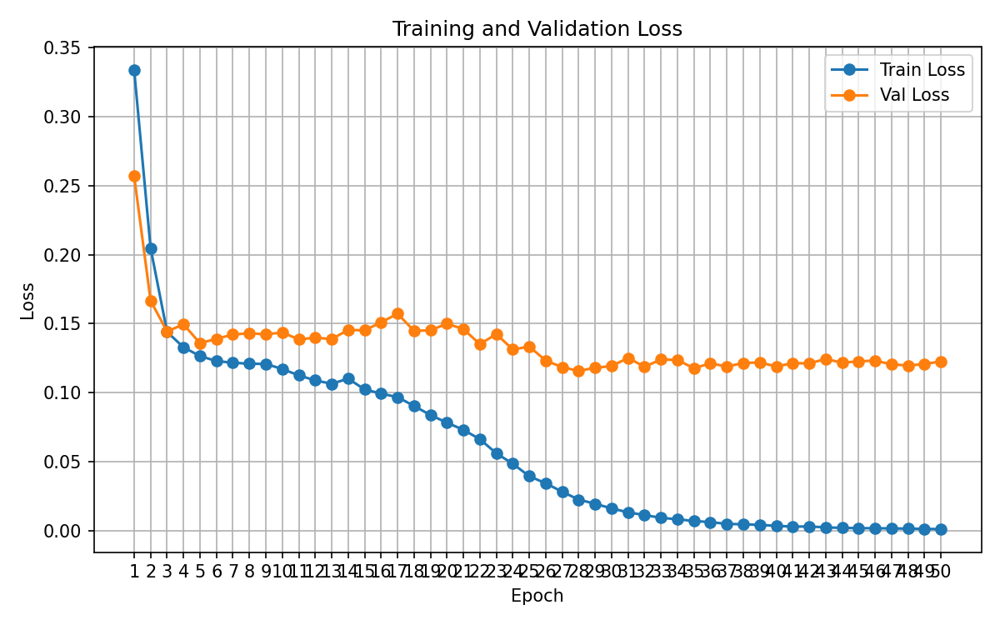
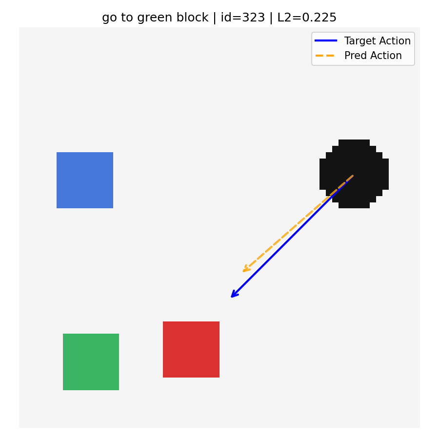
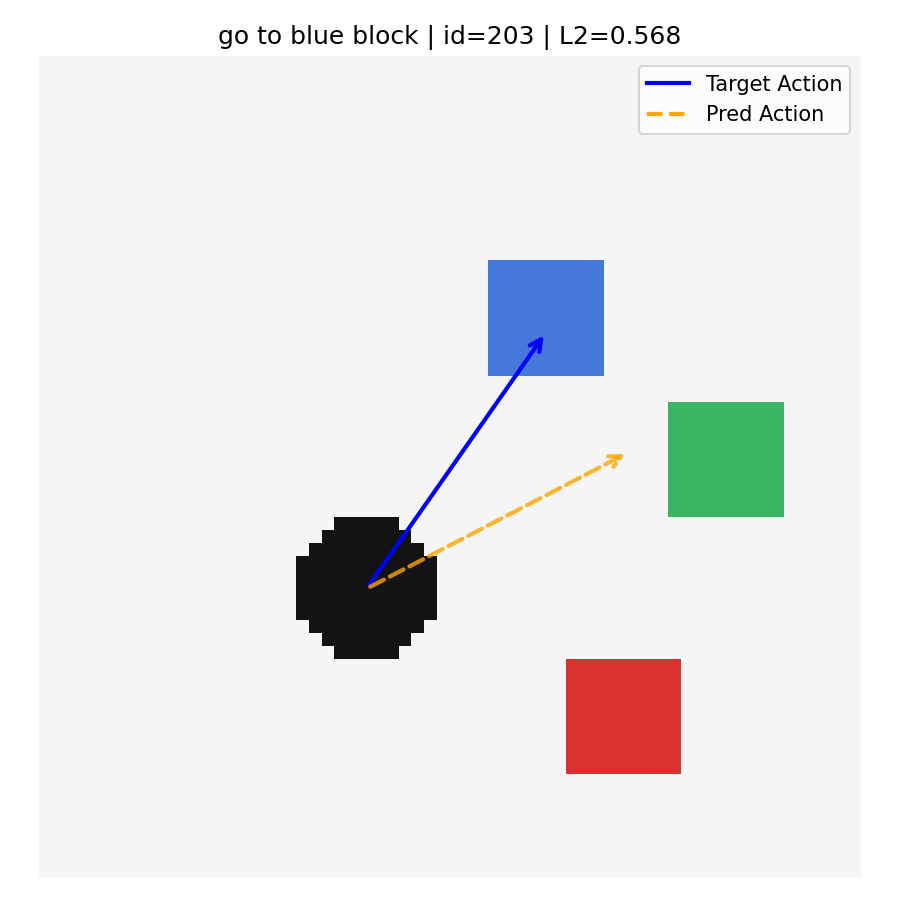
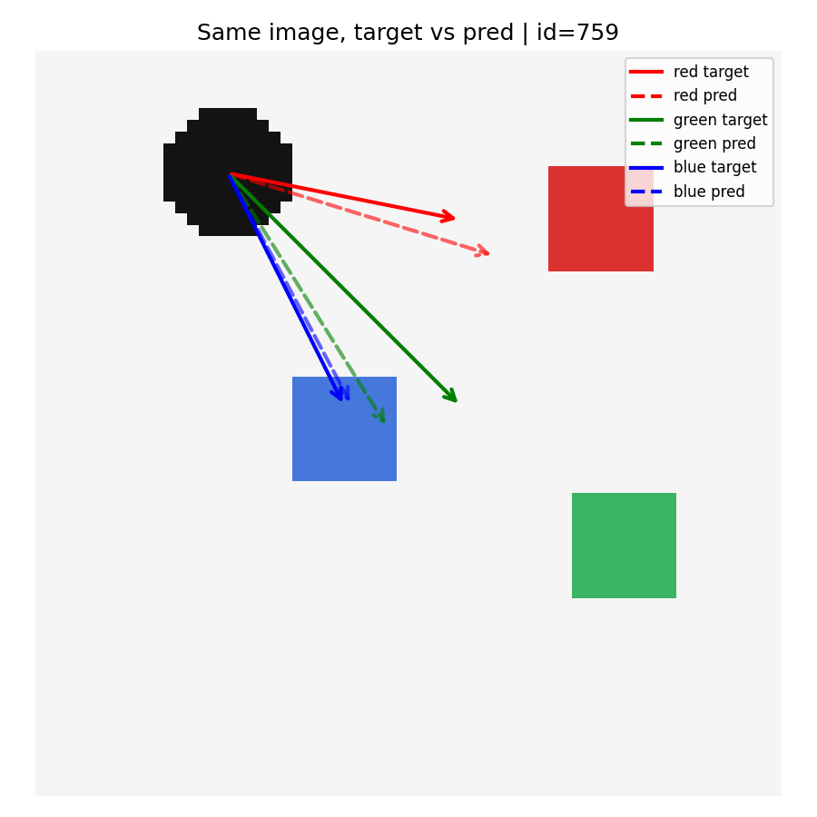
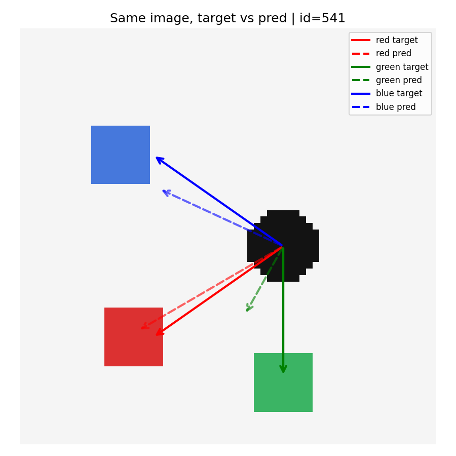

# MiniVLA

一个基于 PyTorch 的 toy 级 Vision-Language-Action 工程项目。

本项目目标是实现一个最小版 VLA 系统：模型输入一张 2D 场景图像和一条语言指令，输出一个连续动作向量，用于表示 agent 应该朝哪个目标块移动。

当前版本为：

MiniVLA v1.0 Resume Version

版本说明：
This release is based on MiniVLA v0.7.4 closed-loop rollout baseline.
```text
structured metadata + full validation metrics + success rate + closed-loop rollout + tuned stop strategy
```

核心能力包括：

- 2D 场景数据自动生成
- 图像 + 文本指令到动作向量的建模
- PyTorch Dataset / DataLoader 数据管线
- MiniVLA 模型训练
- checkpoint 保存
- history.json 记录与 loss 曲线分析
- 全验证集指标评估
- success rate 指标
- 单样本动作预测可视化
- 同图多指令 target/pred 对照可视化
- 二维 closed-loop rollout 仿真
- rollout success rate / improvement rate / final distance 评估
- README、experiment log、model card、project report 文档整理

---

## 1. 项目简介

MiniVLA 是一个教学型 toy VLA 工程项目，用于理解 Vision-Language-Action 系统的基本工程闭环。

在当前环境中，每个样本包含：

- 一张 64x64 的 2D 场景图像
- 一个黑色 agent
- 三个颜色目标块：red、green、blue
- 一条语言指令，例如 `go to red block`
- 一个连续动作标签 `[dx, dy, 0.0]`

模型需要根据图像和语言指令，预测 agent 应该朝目标颜色块移动的动作方向。

任务形式如下：

```text
image + instruction -> action
```

示例：

```text
Input image: 2D scene with agent and colored blocks
Instruction: go to red block
Output action: [dx, dy, 0.0]
```

从 v0.7 开始，项目进一步加入二维闭环 rollout。模型不再只预测一次动作，而是作为一个简单 policy 连续执行：

```text
current image + instruction
  -> predicted action
  -> update agent position
  -> render next image
  -> predict next action
```

---

## 2. 当前版本

当前项目版本：

```text
MiniVLA v0.7.4
```

v0.7.4 的主要能力包括：

1. 在数据中显式保存 `agent_pos` 和 `blocks` 位置信息。
2. 支持自动计算同一张图中不同语言指令对应的 ground-truth action。
3. 增加全验证集指标评估，包括 MSE、MAE、xy L2 error、方向准确率和 success rate。
4. 支持固定保存样本级可视化图和同图多指令对照图。
5. 新增二维闭环 rollout 仿真，使 agent 能够根据模型预测动作多步移动。
6. 支持 closed-loop success rate、improvement rate、final distance、best distance 和多阈值成功率评估。
7. 在 v0.7.4 中加入调优后的 stop 策略，减少无意义执行，并保持较好的闭环接近能力。

当前 v0.7.4 不只是单步动作预测模型，而是已经具备了一个简化的闭环执行流程：

```text
image + instruction -> action -> update agent position -> render new image -> predict next action
```

---

## 3. 项目结构

当前项目主要结构如下：

```text
mini_vla/
├─ data/
│  ├─ raw/
│  │  └─ images/
│  └─ processed/
│     ├─ dataset.json
│     ├─ train.json
│     └─ val.json
│
├─ docs/
│  ├─ experiment_log.md
│  ├─ model_card.md
│  └─ project_report.md
│
├─ outputs/
│  ├─ checkpoints/
│  │  └─ best_model.pt
│  ├─ visuals/
│  │  ├─ eval_samples/
│  │  └─ compare_instructions/
│  ├─ rollouts_v074/
│  │  ├─ rollout_*.png
│  │  ├─ rollout_*.gif
│  │  └─ rollout_summary.json
│  ├─ eval_metrics.json
│  └─ history.json
│
├─ src/
│  ├─ generate_data.py
│  ├─ prepare_splits.py
│  ├─ dataset.py
│  ├─ model.py
│  ├─ train.py
│  ├─ plot_history.py
│  ├─ eval_metrics.py
│  ├─ eval_samples.py
│  ├─ compare_instructions.py
│  └─ simulate_rollout.py
│
└─ README.md
```

---

## 4. 核心文件说明

| 文件 | 作用 |
|---|---|
| `src/generate_data.py` | 生成 2D toy VLA 数据，包括图像、指令、动作、agent 位置和目标块位置 |
| `src/prepare_splits.py` | 将完整数据集划分为训练集和验证集 |
| `src/dataset.py` | 定义 PyTorch Dataset，将图像、指令和动作标签转换为模型可读取格式 |
| `src/model.py` | 定义 MiniVLA 模型结构，将图像和文本融合后输出动作 |
| `src/train.py` | 训练模型，计算 train/val loss，保存 best checkpoint 和 history |
| `src/plot_history.py` | 根据 `history.json` 绘制 loss 曲线 |
| `src/eval_metrics.py` | 在整个验证集上统计 MSE、MAE、L2 error、方向准确率和 success rate |
| `src/eval_samples.py` | 保存普通验证样本的 target/pred 动作可视化图 |
| `src/compare_instructions.py` | 保存同一张图在不同语言指令下的 target/pred 对照图 |
| `src/simulate_rollout.py` | 执行二维闭环 rollout，让 agent 根据模型预测动作多步接近目标 |
| `docs/experiment_log.md` | 记录实验设置、指标、观察结果和后续计划 |
| `docs/model_card.md` | 描述模型用途、输入输出、训练数据、指标和限制 |
| `docs/project_report.md` | 项目完整报告，总结背景、方法、实验、结果和后续计划 |

---

## 5. 数据协议

当前 v0.7.4 每条样本格式如下：

```json
{
  "id": 0,
  "image": "data/raw/images/sample_0000.png",
  "instruction": "go to red block",
  "target_color": "red",
  "action": [dx, dy, 0.0],
  "agent_pos": [x, y],
  "blocks": {
    "red": [x, y],
    "green": [x, y],
    "blue": [x, y]
  }
}
```

字段说明：

| 字段 | 含义 |
|---|---|
| `id` | 样本编号 |
| `image` | 场景图像路径 |
| `instruction` | 语言指令 |
| `target_color` | 当前指令对应的目标颜色 |
| `action` | 从 agent 指向目标块的连续动作 |
| `agent_pos` | agent 在图像中的坐标 |
| `blocks` | red、green、blue 三个颜色块的位置 |

动作计算方式：

```text
dx = (target_x - agent_x) / ACTION_SCALE
dy = (target_y - agent_y) / ACTION_SCALE
```

其中：

```text
ACTION_SCALE = 20.0
```

并将动作裁剪到：

```text
[-1.0, 1.0]
```

当前第三维固定为 `0.0`，作为后续扩展 gripper、stop 或其他控制维度的预留接口。

---

## 6. 模型结构

MiniVLA 是一个最小版 Vision-Language-Action 网络。

模型输入：

```text
image: [B, 3, 64, 64]
instruction: [B, max_text_len]
```

模型输出：

```text
action: [B, 3]
```

模型主要由四部分组成：

| 模块 | 作用 |
|---|---|
| Image Encoder | 使用小型 CNN 提取图像空间特征 |
| Text Encoder | 使用 Embedding + mean pooling 提取语言指令特征 |
| Fusion Module | 拼接图像特征和文本特征，并通过 MLP 融合 |
| Action Head | 输出连续动作向量 `[dx, dy, 0.0]` |

整体流程：

```text
image -> CNN image encoder -> image feature
instruction -> embedding + pooling -> text feature
image feature + text feature -> fusion MLP -> action prediction
```

这个结构体现了最小版 VLA 模型的基本思想：

```text
先分别编码视觉和语言，再融合两种模态，最后预测动作。
```

---

## 7. 环境说明

当前项目在以下环境中开发和测试：

```text
OS: Windows
Python: 3.13.12
Device: CPU
PyTorch: CPU version
```

建议使用虚拟环境：

```powershell
python -m venv .venv
```

激活虚拟环境：

```powershell
(Set-ExecutionPolicy -Scope Process -ExecutionPolicy RemoteSigned) ; (& .\.venv\Scripts\Activate.ps1)
```

安装依赖：

```powershell
pip install torch torchvision matplotlib pillow
```

---

## 8. 快速开始

### 8.1 生成数据

```powershell
python -m src.generate_data
```

运行后会生成：

```text
data/processed/dataset.json
data/raw/images/
```

---

### 8.2 划分训练集和验证集

```powershell
python -m src.prepare_splits
```

运行后会生成：

```text
data/processed/train.json
data/processed/val.json
```

---

### 8.3 训练模型

```powershell
python -m src.train
```

训练完成后会生成：

```text
outputs/checkpoints/best_model.pt
outputs/history.json
```

其中：

- `best_model.pt` 保存验证集表现最好的模型参数
- `history.json` 保存每一轮的 train loss 和 val loss

---

### 8.4 绘制 loss 曲线

```powershell
python -m src.plot_history
```

用于观察训练过程是否收敛、是否过拟合。

---

### 8.5 全验证集指标评估

```powershell
python -m src.eval_metrics
```

输出示例：

```text
Evaluation Metrics
============================================================
Num samples: 200
MSE all dims: 0.055784
MAE per dim: [0.2113003134727478, 0.22187753021717072, 0.007809281814843416]
Mean L2 error on xy: 0.340288
Success rate @0.3: 55.50%
Success rate @0.5: 80.50%
X direction accuracy: 95.21%
Y direction accuracy: 93.81%
Both x/y direction accuracy: 88.46%
```

评估结果会保存到：

```text
outputs/eval_metrics.json
```

---

### 8.6 保存普通验证样本可视化图

```powershell
python -m src.eval_samples
```

输出目录：

```text
outputs/visuals/eval_samples/
```

该脚本会固定保存 20 张验证样本图，每张图展示：

- 当前场景
- agent 位置
- 真实动作箭头
- 模型预测动作箭头
- xy L2 error

同时保存：

```text
outputs/visuals/eval_samples/eval_samples_summary.json
```

---

### 8.7 保存同图多指令对照图

```powershell
python -m src.compare_instructions
```

输出目录：

```text
outputs/visuals/compare_instructions/
```

该脚本会固定保存 5 张同图多指令对照图。

每张图会对同一场景分别输入：

```text
go to red block
go to green block
go to blue block
```

并比较每条指令下的：

- target action
- pred action
- xy L2 error

同时保存：

```text
outputs/visuals/compare_instructions/compare_instructions_summary.json
```

---

### 8.8 运行二维闭环 rollout 仿真

v0.7.4 支持二维闭环 rollout。模型不再只预测一次动作，而是作为 policy 连续执行多步动作，使 agent 根据当前图像和语言指令逐步移动到目标附近。

运行命令：

```powershell
python -m src.simulate_rollout
```

输出目录：

```text
outputs/rollouts_v074/
```

该脚本会保存：

```text
rollout_01_id_xxx_success.png
rollout_01_id_xxx_success.gif
rollout_02_id_xxx_fail.png
rollout_02_id_xxx_fail.gif
...
rollout_summary.json
```

每个 rollout 会记录：

- 初始 agent 位置
- 目标块位置
- 每一步预测动作
- 每一步 agent 位置
- 最终距离
- 最优距离
- 是否成功
- 是否相比初始位置更接近目标
- 停止原因

v0.7.4 当前使用的闭环配置如下：

| Item | Value |
|---|---:|
| Max steps | 20 |
| Execution scale | 6.0 |
| Primary success radius | 6.0 |
| Stop radius | 6.0 |
| No-improve patience | 5 |
| Min improvement | 0.1 |

---

## 9. 当前实验结果

当前项目包含两类主要评估：

1. 单步动作预测评估
2. 闭环 rollout 执行评估

---

### 9.1 单步动作预测结果

当前 v0.7.4 沿用 v0.6 baseline 的单步模型指标：

| Metric | Value |
|---|---:|
| Num validation samples | 200 |
| Best val loss / MSE | 0.0558 |
| MAE dx | 0.2113 |
| MAE dy | 0.2219 |
| MAE third dim | 0.0078 |
| Mean L2 error on xy | 0.3403 |
| Success rate @0.3 | 55.50% |
| Success rate @0.5 | 80.50% |
| X direction accuracy | 95.21% |
| Y direction accuracy | 93.81% |
| Both x/y direction accuracy | 88.46% |

这些指标说明模型已经较好地学习到单步动作方向，但动作幅度预测仍有提升空间。

---

### 9.2 闭环 rollout 结果

v0.7.4 将模型作为 policy 放入二维闭环仿真中执行。模型每一步根据当前图像和语言指令预测动作，agent 根据动作移动后重新渲染场景，并继续预测下一步动作。

v0.7.4 闭环结果如下：

| Metric | Value |
|---|---:|
| Num rollouts | 20 |
| Primary success count | 3 / 20 |
| Primary success @6 | 15.00% |
| Improvement count | 19 / 20 |
| Improvement rate | 95.00% |
| Avg initial distance | 25.225 |
| Avg final distance | 10.113 |
| Avg best distance | 8.980 |
| Avg distance reduction | 15.112 |
| Avg best distance reduction | 16.245 |
| Avg steps executed | 11.00 |

Final success rates:

| Metric | Value |
|---|---:|
| Final success @6 | 15.00% |
| Final success @8 | 30.00% |
| Final success @10 | 50.00% |

Best success rates:

| Metric | Value |
|---|---:|
| Best success @6 | 15.00% |
| Best success @8 | 40.00% |
| Best success @10 | 60.00% |

Stop reasons:

| Stop reason | Count |
|---|---:|
| no_improvement_stop | 16 |
| primary_success | 3 |
| max_steps | 1 |

结果表明，模型虽然在严格 6 像素成功半径下成功率只有 15.00%，但 95.00% 的 rollout 都使 agent 更接近目标，说明模型已经具备初步闭环目标接近能力。

在较宽松的 10 像素阈值下，final success rate 达到 50.00%，best success rate 达到 60.00%，说明许多失败样本并非完全跑偏，而是停留在目标附近。

---

## 10. 指标解释

| 指标 | 含义 |
|---|---|
| MSE all dims | 所有动作维度上的均方误差 |
| MAE dx / dy | x/y 动作维度的平均绝对误差 |
| MAE third dim | 第三维动作的平均绝对误差 |
| Mean L2 error on xy | xy 平面预测动作和真实动作的平均距离 |
| Success rate @0.3 | xy L2 error 小于等于 0.3 的样本比例 |
| Success rate @0.5 | xy L2 error 小于等于 0.5 的样本比例 |
| X direction accuracy | x 方向正负号预测正确率 |
| Y direction accuracy | y 方向正负号预测正确率 |
| Both x/y direction accuracy | x 和 y 方向同时预测正确的比例 |
| Primary success @6 | rollout 最终进入 6 像素目标半径的比例 |
| Improvement rate | rollout 最终距离小于初始距离的比例 |
| Avg final distance | rollout 最终 agent 与目标之间的平均距离 |
| Avg best distance | rollout 过程中 agent 曾达到的最小平均距离 |
| Final success @8 / @10 | 最终距离进入 8 或 10 像素范围的比例 |
| Best success @8 / @10 | rollout 过程中曾进入 8 或 10 像素范围的比例 |

---

## 11. 结果分析

从当前 v0.7.4 结果可以看出：

1. 单步预测中，模型已经具备较强的方向判断能力，x/y 同时方向正确率达到 88.46%。
2. 单步 `success rate @0.5` 达到 80.50%，说明在较宽松阈值下，模型可以完成大部分单步动作预测任务。
3. 单步 `success rate @0.3` 为 55.50%，说明在更严格阈值下，动作精度仍有提升空间。
4. 第三维动作误差很小，说明当前第三维基本被模型学会。
5. 主要误差集中在 dx/dy 的幅度预测上，模型常常能判断正确方向，但不一定能准确预测动作长度。
6. 同图多指令对照实验显示，模型输出会随着语言指令变化，说明文本条件已经对动作预测产生影响。
7. 闭环 rollout 中，模型严格成功率较低，`Primary success @6` 为 15.00%。
8. 但是闭环 `Improvement rate` 达到 95.00%，说明模型在大多数 rollout 中都能使 agent 更接近目标。
9. 在 10 像素宽松阈值下，`Final success @10` 达到 50.00%，`Best success @10` 达到 60.00%，说明很多失败样本已经接近目标附近。
10. 当前闭环主要问题不是完全走错方向，而是末端精细控制不足。

---

## 12. 可视化结果

### 12.1 普通验证样本可视化

运行：

```powershell
python -m src.eval_samples
```

输出路径：

```text
outputs/visuals/eval_samples/
```

示例文件：

```text
eval_sample_01_id_828.png
eval_sample_02_id_610.png
...
eval_sample_20_id_405.png
```

这些图用于观察模型在普通验证样本上的动作预测表现。

---

### 12.2 同图多指令对照可视化

运行：

```powershell
python -m src.compare_instructions
```

输出路径：

```text
outputs/visuals/compare_instructions/
```

示例文件：

```text
compare_01_id_768.png
compare_02_id_274.png
compare_03_id_541.png
compare_04_id_759.png
compare_05_id_166.png
```

这些图用于观察模型在同一张图下是否会根据不同语言指令预测不同动作。

---

### 12.3 闭环 rollout 轨迹可视化

运行：

```powershell
python -m src.simulate_rollout
```

输出路径：

```text
outputs/rollouts_v074/
```

示例文件：

```text
rollout_01_id_xxx_fail.png
rollout_01_id_xxx_fail.gif
rollout_02_id_xxx_success.png
rollout_02_id_xxx_success.gif
...
rollout_summary.json
```

这些图和 GIF 用于观察 agent 在闭环执行中的移动轨迹。

---
## Demo Figures

### Loss Curve



### Evaluation Samples

Successful prediction example:



Failure or error analysis example:



### Same-image Multi-instruction Comparison

Good language-conditioned prediction example:



Failure or weak language-conditioning example:



### Closed-loop Rollout Demo


## 13. 当前已完成内容

当前项目已完成：

- 数据生成
- Dataset / DataLoader
- MiniVLA 模型
- 训练脚本
- checkpoint 保存
- history.json 保存
- loss 曲线分析
- 模型结构改进
- 结构化数据协议
- 全验证集指标评估
- success rate 指标
- 普通验证样本可视化保存
- 同图多指令对照可视化保存
- 二维闭环 rollout 仿真
- closed-loop success rate 评估
- improvement rate 评估
- rollout png / gif 保存
- README.md
- docs/experiment_log.md
- docs/model_card.md
- docs/project_report.md

---

## 14. 当前限制

当前项目仍有以下限制：

1. 场景仍是简单 2D toy environment，不是真实机器人环境。
2. 语言指令模板较单一，主要是 `go to {color} block`。
3. 动作空间较简单，只是从 agent 指向目标块的连续位移。
4. 当前模型结构仍较小，没有使用 Transformer 或更强的视觉 backbone。
5. 当前闭环 rollout 仍是 toy setting，不是真实机器人控制。
6. closed-loop success rate 使用的是目标距离阈值，是 toy setting 下的近似成功定义。
7. 当前第三维动作固定接近 0，还没有引入 gripper、stop 等真实控制含义。
8. 模型没有显式 stop 动作，停止逻辑由规则控制。
9. 数据集规模仍较小，目前为 1000 条样本。
10. 模型在末端精细控制上仍然不足，接近目标后不一定能稳定进入严格成功半径。

---

## 15. 后续计划

后续计划包括：

1. 继续逐行理解 `dataset.py`、`model.py`、`train.py`、`eval_samples.py`、`simulate_rollout.py` 等核心文件。
2. 扩展语言模板，例如加入 `move to`、`reach the`、`navigate to` 等表达。
3. 增加更多数据样本，提高泛化能力。
4. 为闭环控制增加更合理的执行策略，例如自适应步长或显式 stop 动作。
5. 增加近距离样本，提高模型末端精细控制能力。
6. 尝试更强的模型结构，例如加入 attention 或更强 CNN encoder。
7. 整理最终简历项目描述和面试讲解材料。
8. 未来可进一步尝试对接更真实的仿真环境。

---

## 16. 项目亮点

当前项目的主要亮点：

1. 完成了从数据生成到模型训练、评估、可视化和闭环仿真的完整流程。
2. 数据协议中显式保存 agent 与目标块位置，便于自动生成多指令 ground truth。
3. 模型支持图像和语言双输入，并输出连续动作向量。
4. 实现了全验证集数值指标，而不是只观察少量样本。
5. 实现了 success rate 指标，使评估更接近任务成功标准。
6. 实现了同图多指令对照实验，用于验证模型是否利用语言条件。
7. 固定保存可视化图片和 summary json，便于复现实验和项目展示。
8. 实现了二维闭环 rollout，使模型能够作为 policy 多步执行。
9. 记录了 closed-loop success rate、improvement rate、final distance 和 best distance。
10. 形成了 README、experiment log、model card 和 project report 等完整文档体系。

---

## 17. 简历描述草稿

可以初步写成：

> 基于 PyTorch 实现一个 toy 级 Vision-Language-Action 系统，完成从 2D 场景数据生成、图文动作建模、训练验证、checkpoint 保存、全验证集指标评估到同图多指令可视化对照的完整闭环。模型输入为场景图像和自然语言指令，输出连续动作向量。项目设计了包含 agent 与多目标位置的结构化数据协议，并实现 MSE、MAE、xy L2 error、方向准确率和 success rate 等指标，用于系统分析模型的动作预测能力和语言条件利用情况。

v0.7.4 之后可以进一步扩展为：

> 在单步动作预测基础上，进一步实现二维 closed-loop rollout 仿真，使 agent 能够根据模型预测动作多步接近语言指定目标，并统计 closed-loop success rate、improvement rate、final distance 和 best distance。实验显示模型在 95% 的 rollout 中能够使 agent 更接近目标，具备初步闭环目标接近能力。

---

## 18. 说明

本项目是一个教学型 toy VLA 工程，目标不是复现 OpenVLA、RT-1、RT-2 等大型系统，而是通过一个可控小环境理解 VLA 工程的核心组成部分：

```text
data -> dataset -> model -> train -> evaluate -> visualize -> rollout -> document
```

当前版本重点在于建立最小工程闭环和评估体系，为后续扩展到更复杂的仿真环境或真实机器人任务打基础。